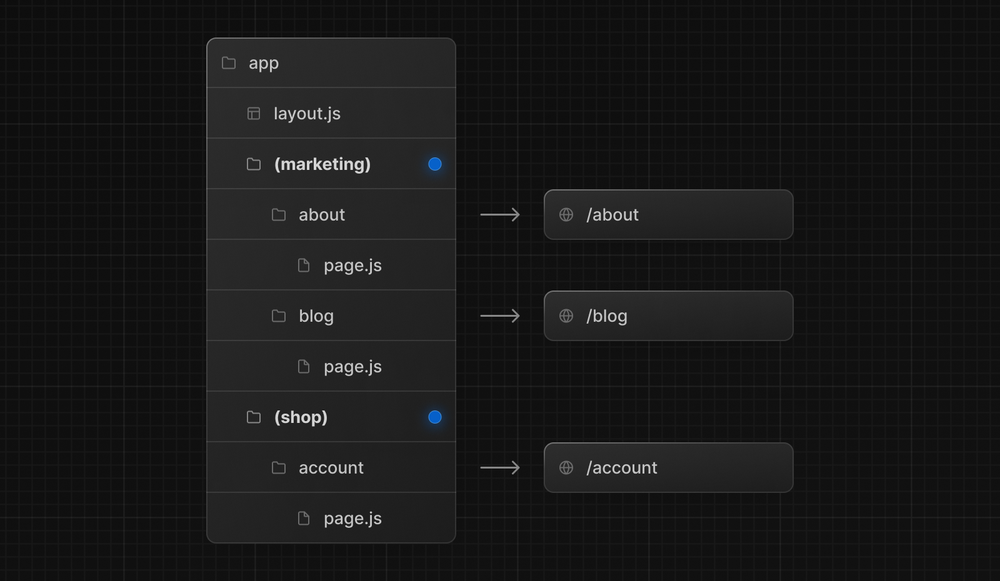
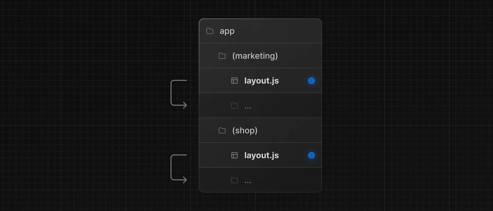
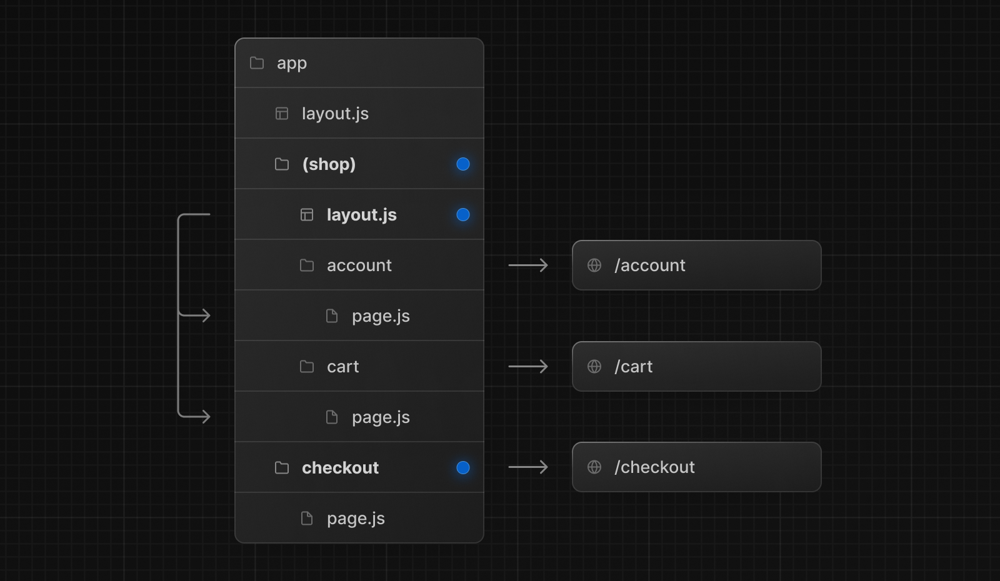

# NextJS Fullstack App Router


### Financial dashboard with the following
- A public home page.
- A login page.
- Dashboard pages that are protected by authentication.
- The ability for users to add, edit, and delete invoices.

### Stack
- Next.JS (App Router)
- Auth.JS
- Tailwind
- Prisma + PostgreSQL

### Database
- PostgreSQL
- Relational Schema
```sql
SELECT invoices.amount, customers.name
FROM invoices
JOIN customers ON invoices.customer_id = customers.id
WHERE invoices.amount = 666;
```

## Using App Router to its fullest with nested routing


## Route Groups
<i>In the app directory, nested folders are normally mapped to URL paths. However, you can mark a folder as a Route Group to prevent the folder from being included in the route's URL path.</i>



### Creating multiple root layouts
<i>To create multiple root layouts, remove the top-level layout.js file, and add a layout.js file inside each route groups. This is useful for partitioning an application into sections that have a completely different UI or experience. The `<html>` and `<body>` tags need to be added to each root layout.</i>

<i>Even though routes inside (marketing) and (shop) share the same URL hierarchy, you can create a different layout for each group by adding a layout.js file inside their folders.</i>



### Opting specific segments into a layout
<i>To opt specific routes into a layout, create a new route group (e.g. (shop)) and move the routes that share the same layout into the group (e.g. account and cart). The routes outside of the group will not share the layout (e.g. checkout).</i>



## Making the dashboard dynamic

You can use a Next.js API called unstable_noStore inside your Server Components or data fetching functions to opt out of static rendering.

In your file, import unstable_noStore from next/cache, and call it the top of your data fetching functions:

```typescript
import { unstable_noStore as noStore } from 'next/cache';
 
export async function fetchRevenue() {
  // Add noStore() here to prevent the response from being cached.
  // This is equivalent to in fetch(..., {cache: 'no-store'}).
  noStore();
  // ...
}
 
export async function fetchLatestInvoices() {
  noStore();
  // ...
}
```

## FAQ

### When might you want to use a waterfall pattern?

```typescript
const revenue = await fetchRevenue();

// Wait for fetchRevenue() to finish
const latestInvoices = await fetchLatestInvoices(); 

// Wait for fetchLatestInvoices() to finish
const { numberOfInvoices, numberOfCustomers } = await fetchCardData(); 
```

Satisfy a condition before making the next request

<i>For example, you might want to fetch a user's ID and profile information first. Once you have the ID, you might then proceed to fetch their list of friends.</i>

### Parallel data fetching
<i>A common way to avoid waterfalls is to initiate all data requests at the same time - in parallel.

In JavaScript, you can use the Promise.all() or Promise.allSettled() functions to initiate all promises at the same time. For example, in data.ts, we're using Promise.all() in the fetchCardData() function:</i>

```typescript
export async function fetchCardData() {
  try {
    const invoiceCountPromise = sql`SELECT COUNT(*) FROM invoices`;
    const customerCountPromise = sql`SELECT COUNT(*) FROM customers`;
 
    const data = await Promise.all([
      invoiceCountPromise,
      customerCountPromise
    ]);
  }
}
```

### What is streaming?

Streaming is a data transfer technique that allows you to break down a route into smaller "chunks" and progressively stream them from the server to the client as they become ready.

```typescript
// Since loading.tsx is a level higher than /invoices/page.tsx and /customers/page.tsx in the file system, it's also applied to those pages.
export default function Loading() {
  return <div>Loading...</div>;
}
```

### Deciding where to place your Suspense boundaries

Where you place your Suspense boundaries will depend on a few things:

1. How you want the user to experience the page as it streams.

2. What content you want to prioritize.

3. If the components rely on data fetching.


Don't worry. There isn't a right answer.

- You could stream the whole page like we did with loading.tsx... but that may lead to a longer loading time if one of the components has a slow data fetch.

- You could stream every component individually... but that may lead to UI popping into the screen as it becomes ready.

- You could also create a staggered effect by streaming page sections. But you'll need to create wrapper components.

## Default Props Provided to a Page By Next.JS App Router

```typescript
export default function Page({
  params,
  searchParams,
}: {
  params: { slug: string }
  searchParams: { [key: string]: string | string[] | undefined }
}) {
  return <h1>My Page</h1>
}
```

## Difference between Server Actions and Server Components

```typescript
// Server Component
export default function Page() {
  // Action
  async function create(formData: FormData) {
    'use server';
 
    // Logic to mutate data...
  }
 
  // Invoke the action using the "action" attribute
  return <form action={create}>...</form>;
}
```

### Server Action Creation outside component
```typescript
'use server';

export async function createInvoice(formData: FormData) {

  const rawFormData = {
    customerId: formData.get('customerId'),
    amount: formData.get('amount'),
    status: formData.get('status'),
  };

  const multipleEntries = Object.fromEntries(formData.entries());

  // Test it out:
  console.log({rawFormData, multipleEntries});

  // {
  //   rawFormData: {
  //     customerId: '126eed9c',
  //     amount: '222',
  //     status: null
  //   },
  //     multipleEntries: { customerId: '126eed9c', amount: '222' }
  //   }
}
```

## Credits
- [NextJS App Router Introduction](https://nextjs.org/learn)
- [NextJS App Router Docs](https://nextjs.org/docs)
